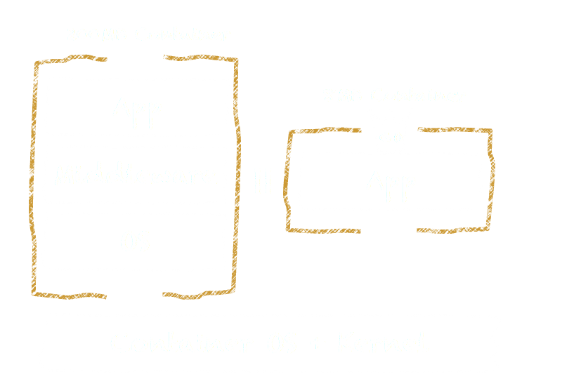
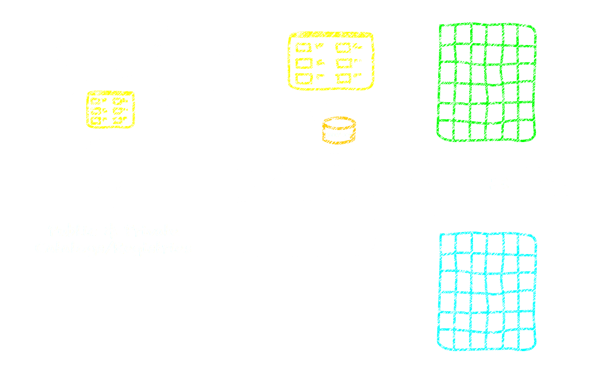
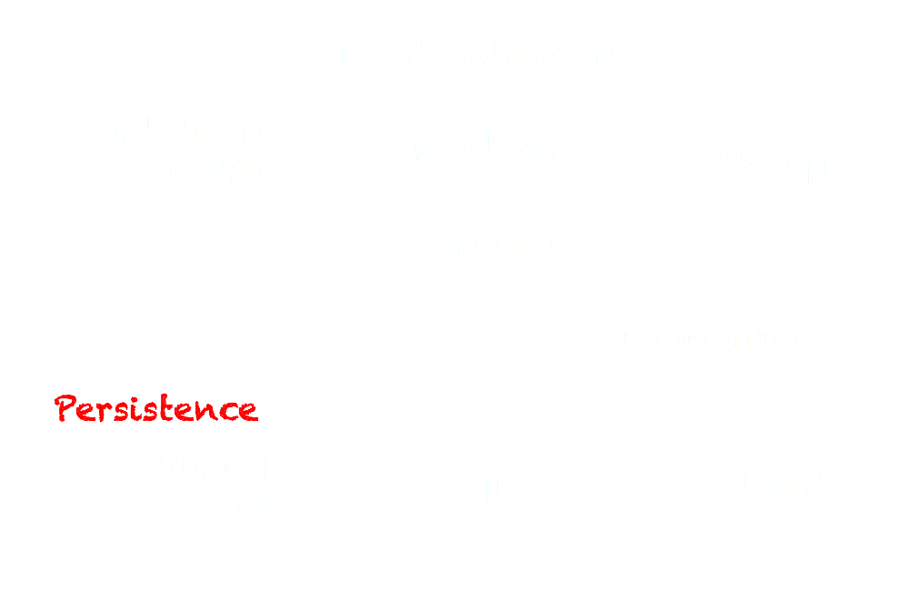

footer: EMC {code} - @clintonskitson - emccode.github.io
slidenumbers: true

# [fit] Containers vs VMs
### Competition of Co-Existance?

#### Clint Kitson - EMC {code} developerAdvocate

^
- Intro
- Focus on Developer views of Containers and VMs

---

# [fit] COMPETITION IS GOOD, CUSTOMERS WIN

^
- Competition drives technology forward
- Akin to the massive changes we are seeing in mobile technology, the new architectures and ways of doing things that are actually supporting DevOps are massively disruptive
- There is now a target to satisfy those DevOps type people in your organization

---

# [fit] Hey Ops!
# What do you care about?

^
- Let's try and peel back the onion a bit and understand what each group is driving towards
- Big surprise..

---

# [fit] VMs, SDDC, and Self-Service.

^
- These are the hot button things that are probably being driven right now
- Have good merit, but let's look at these compared to a Dev's view

---

# [fit]Devs!
# What do you care about?

^
- Now on to the developers who create features to drive the business objectives and differentiation

---

- The Apps
- Continuously deploying features
- Abstracted and controlled software architectures
 - Infrastructure as Code
- **Getting what I want when I want it**
- **Consistency**
- **Frictionless deployments**

^
- They want to care about as little as possible and ensure they can achieve their goals
- Business is driving them towards continuously integrating features
- Realize that to get there infrastructure is critical and embedding infrastructure in a complete "system" where the app is aware is key
- Want to work autonomously and leverage key open-source technology to make their lives easier
- Want a packaging technology that works across any platform to eliminate dependency hell

---

# Develop **Anywhere** and Deploy **Everywhere**
# Consistent Packaging and Deployment

^
- Is this "Deploy Everywhere" Hybrid Cloud?  How about deploy on the laptop, how about on a PaaS platform, how about on an IaaS offering?  Here there anywhere
- Does Ops even have "Develop Anywhere" in the minds?
- This leads us to the technology view that Devs are looking for.  Consitent packaging and deployment will ensure they can develop on their laptops with DevOps tools, and ship it anywhere.

---

# It sure sounds like a VM from a self-service Portal would be perfect!

^
- Now let's back back to the conversation between Dev and Ops.  Even without listening to the Devs, Ops has it all figured out already and the direct ouput from the portal would be considered the self-service portal to satisfy their needs.

---

# [fit] INCOMING!
# Try again!

^
- This is where the conflict arises
- What happens when Ops doesn't deliver what is needed?
- Shadow IT
- Now let's take a peak at what may be wrong with the Ops approach

---

# Where's the friction here?

^
- Devs want continuous integration where a manual step is only required to approve shipping code to production
- Don't want to push a button to deploy a server and then wait to find out how to get to it
- The "vm container" typically is shipped all the way through middleware and is then tied to the Hypervisor type.  If you want cross-platform capabilities, there is a lot of work in ensuring you have "vm containers" for each platform that support dependencies.  This translates waiting for Ops.
- not consistent and not portable
- There is a new abstraction layer needed and a right combination of things to make a "container"

---

^
- if a goal of developer is to develop autonomously and depoy anywhere, what is the consistent packaging? The app, but this relies on Ops to determine the location and make an environment support the specific needs of the app.  This represents a lot of coordination and likely frustration.
- in comes the new frictionless packaing format, the container which is focused on the app
- then you're left with the "container" which to developers includes app+dependencies and is shippable anywhere
- major thing is that the kernel is brought out of the container space and resides only in the container OS, shared by other containers

---

^
- a lot of facets to Docker, but one of the most beneficial is the consistent packaging on top of a common abstraction layer
- new layer is called the container OS, where a minimal OS is deployed to support core funcitonality of running containers
- looking to the future, there is also a way to deploy containers that do not require apps which is the most ideal for developers and ops

---

^
- The Container OS represents a new abstraction layer similar to how Hypervisor's provided HW stability below VMs
- For shops focused on controlling the infrastructure IaaS and running container OS's themselves, the Container OS can be ran on top of bare metal, but it is likely that most shops choose to run them on top of a hw virtualization layer.  Run them anywhere.
- For shops focused on leveraging PaaS services to manage all infrastructure aspects, there are services like Cloud Foundry to provide this.
- At the end of the day, we have consistency through the packaging
- Devs can develop autonomously and use laptops to create containers that get shippped to production

---

^
- So now we have a common tool, abstraction layer, and packaging method for apps, how does this fit into continuously integrating?
- DevOps teams are able to create systems that focos on infrastructure as code
- Devs can autonomously iterate to develop features through the flow
- Features and releases show up as cotainer images that eventually get approved to be shipped to production
- Where these containers live has little importance, the focus is then on blue-green style deployments where fail-fast is used to determine whether new releases work or not

---

# [fit] CHALLENGES

^
- With all the good things, there are new challenges to make containers relevant to your strategy

---

# [fit] DEPLOYMENT MODELS

^
- First let's take a look at the expectations with a container
- Packaging VMs as containers is not the right way to go

---

^
- Containers and continuous integration excels with micro-service style architectures
- This means taking a monolithic app and breaking it down to key services that exist as their own containers which can scale out
- These are then glued together using service discovery tools tools, message buses, and routing layers to ensure the app works together as a system
- There is more complexity, but this is where adopting infrastrucutre-as-code techniques will have huge advantages to handle this new complexity

---

# READY FOR MICRO-SERVICE ARCHITECTURES?

^
- So is your app ready for a micro-service architecture?
- Is the app you are buying ready for it?

---

# [FIT] CONTAINERS ARE PERSISTENT, BUT...
## Storage for containers is typically local DAS
## North-South availability is not top priority

^
- Containers today are typically used in non-persistent use cases
- This has driven the notion that storage isn't important for containers
- But the tide is changing, and storage is becoming an important facet to ensuring containers can be a good fit for new use cases

---

# [fit] NEW ECOSYSTEM
## Software Agents are not built for containers yet

^
- The old model of OS+kernel on a VM has been around for a long time, and thus a large eco-system of partners to support the needs.
- Things like application level intelligence for data consistency today should be provided by the app
- Dump and sweep protection methods are applicable for containers

---
# TYPICAL MICRO-SERVICE APPLICATION ARCHITECTURES

^
- So what does a common micro-service architecture look like with containers?
- You can break the architecture into two pieces, one being the persistent things and the other being the non-persistent
- non-persistent things that have availability built into the application layer are commonly deployed in containers on VMs
- These are then connected, with low latency in mind, to persistent storage being served from VMs or cloud resources

---

# [fit] WHY CONTAINERS WITH VMS?

^
- But why VMs with containers?

---

- VSPHERE STABILITY HAS DONE GREAT THINGS FOR OPERATIONS

^
- No one wants to get into the business of managing OS's on hardware.  vSphere is a great example of a minimal hypervisor that has allowed Ops to minimize time spent in this area.

---

- VSPHERE STABILITY HAS DONE GREAT THINGS FOR OPERATIONS
- ABSTRACTION FROM HARDWARE

^
- A hardware abstraction layer can be useful for certain scenarios such as moving running containers to new hardware which isn't possible today (but may not be necessary with micro-service architectures)

---

- VSPHERE STABILITY HAS DONE GREAT THINGS FOR OPERATIONS
- ABSTRACTION FROM HARDWARE
- SECURITY AND ISOLATION

^
- Containers will likely struggle to ensure security and isolation from other containers.  Some container providers run containers as individual VMs today, or run VMs with containers dedicated to customers.

---

- VSPHERE STABILITY HAS DONE GREAT THINGS FOR OPERATIONS
- ABSTRACTION FROM HARDWARE
- SECURITY AND ISOLATION
- STORAGE
- NETWORKING

^
- Both are evolving!
- Storage services can easily be abstracted today with virtualization and provided as granular levels to container OSs
- Containers themselves are still figuring out how to be a proper citizen in a networking world (L3/L4).  SDN is largely targeted at VMs today.

---

# CONCLUSION
CONTAINERS AND VMS ARE SYMBIOTIC
CONTAINERS ALLOW PORTABILITY
SUPPORT DEVELOPMENT ANYWHERE AND DEPLOYING EVERYWHERE

^
- Containers are good for VMs since they provide a much needed layer of app intelligence
- VMs are good for containers since they provide a hardware abstraction layer
- The future will likely find further synergies and cross-polination between the two things -- maybe even a new VM that is purely a container VM
- Containers solve some major hybrid cloud challenges with apps
- If the mission is developing anywhere and deploying everywhere, they fit the bill perfectly.

---

#DEVOPS@EMCWORLD!
# FREE PRE-SHOW EVENT
# Sunday @the Venetian 2p-6p

---

# [fit] THANK YOU
