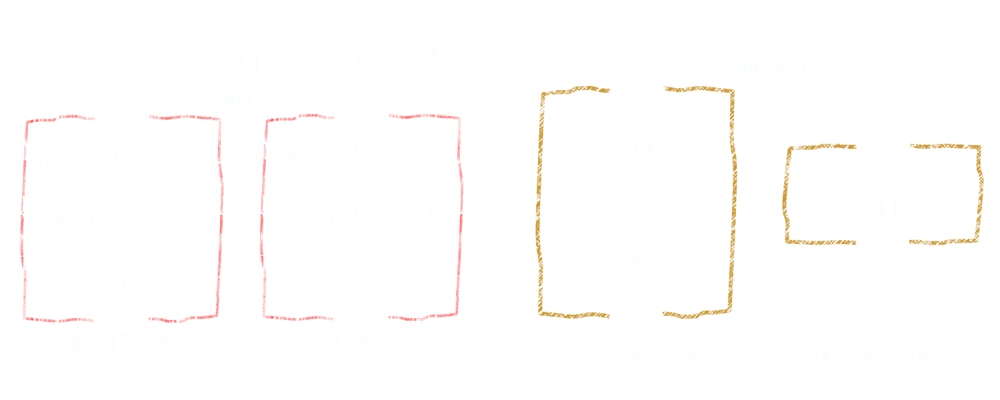

footer: EMC {code} - @clintonskitson - emccode.github.io
slidenumbers: true

# [fit] Containers vs VMs
### Competiton of Co-Existance?

#### Clint Kitson - EMC {code} developerAdvocate

^
VMs have become the norm in data centers, but hypervisor differentiation is slowing. New technology like Docker have simplified the usage of Containers, but is still commonly using VMs. Learn how Containers and Virtual Machines can be complimentary and how the competition is improving both technologies.

---

# [fit] COMPETITION IS GOOD, CUSTOMERS WIN

---

# [fit] Hey Ops!
# What do you care about?

---

# [fit] VMs, SDDC, and Self-Service.

^
Setup the argument where Ops is heavily focused on these things

---

# [fit]Devs!
# What do you care about?

^

---

- The Apps
- Continuously deploying features
- Abstracted and controlled software architectures
 - Infrastructure as Code
- **Getting what I want when I want it**
- **Consistency**
- **Frictionless deployments**

---

# Develop **Anywhere** and Deploy **Everywhere**
# Consistent Packaging and Deployment

---

# It sure sounds like a VM from a self-service Portal would be perfect!

---

# [fit] INCOMING!
# Try again!

---

# Where's the friction here?

---

---

---

---

---

# [fit] CHALLENGES

---

# [fit] DEPLOYMENT MODELS

---

---

# READY FOR MICRO-SERVICE ARCHITECTURES?

---

# [FIT] CONTAINERS ARE PERSISTENT, BUT...
## Storage for containers is typically local DAS
## North-South availability is not top priority

---

# [fit] NEW ECOSYSTEM
## Software Agents are not built for containers yet

---
# TYPICAL MICRO-SERVICE APPLICATION ARCHITECTURES

---

# [fit] WHY CONTAINERS WITH VMS?

---

- VSPHERE STABILITY HAS DONE GREAT THINGS FOR OPERATIONS

---

- VSPHERE STABILITY HAS DONE GREAT THINGS FOR OPERATIONS
- ABSTRACTION FROM HARDWARE

---

- VSPHERE STABILITY HAS DONE GREAT THINGS FOR OPERATIONS
- ABSTRACTION FROM HARDWARE
- SECURITY AND ISOLATION

---

- VSPHERE STABILITY HAS DONE GREAT THINGS FOR OPERATIONS
- ABSTRACTION FROM HARDWARE
- SECURITY AND ISOLATION
- STORAGE
- NETWORKING

---

# CONCLUSION
CONTAINERS AND VMS ARE SYMBIOTIC
CONTAINERS ALLOW PORTABILITY
SUPPORT DEVELOPMENT ANYWHERE AND DEPLOYING EVERYWHERE

---

#DEVOPS@EMCWORLD!
# FREE PRE-SHOW EVENT
# Sunday @the Venetian 2p-6p

---

# [fit] THANK YOU
